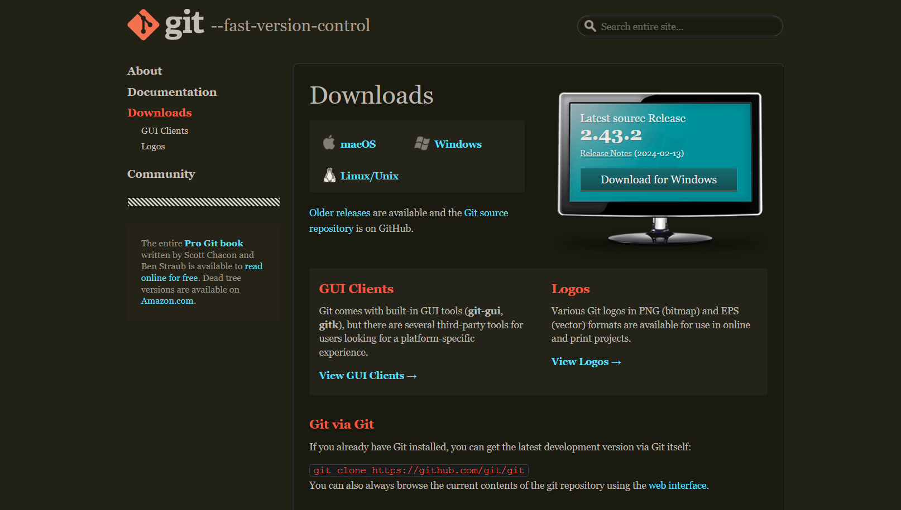
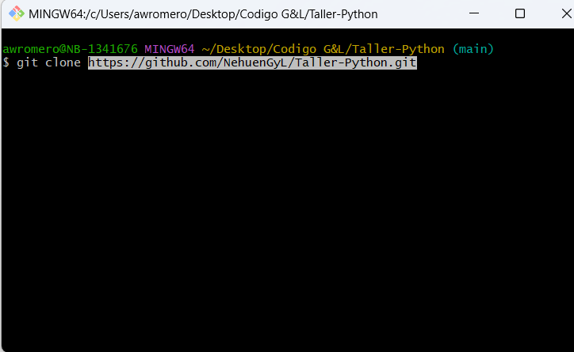

# Instalación de Herramientas

#### Preparando tu computadora
Antes de comenzar deberás descargar en tu computadora las siguientes herramientas de trabajo:
1. Editor de texto
2. Git
3. Github
4. Python

## Editores de Texto

Para poder escribir código que pueda ser interpretado por un lenguaje de programación, necesitamos utilizar un editor de texto.

## Visual Studio Code

  
  

Es un editor desarrollado por Microsoft.

Tiene integrado el control de versiones mediante Git y Github para tener un seguimiento de tus proyectos. Brinda una cantidad de extensiones que facilitan el trabajo de un desarrollador.

Para descargarlo, nos dirigimos al sitio oficial, en la sección Download y descargamos el instalador según nuestro Sistema Operativo:

<https://code.visualstudio.com/download>

#### otra opción seria desde el store de tu pc

  
  

Una vez finalizada la descarga, procedemos a ejecutar el instalador.

### Luego de instalarlo les dejamos el siguiente video para que puedan instalar las dependencias que necesitan para el taller

<https://www.youtube.com/watch?v=xS5ZXOC4e6A>

## Git

### ¿Qué es Git?

Git es un sistema de control de versiones, distribuido y open source. Un control de versiones es un sistema que registra los cambios realizados en un archivo o conjunto de archivos a lo largo del tiempo, de modo que puedas recuperar versiones específicas más adelante.

### Instalación

#### Para Mac y Linux

Ver estos enlaces:

<https://git-scm.com/book/es/v2/Inicio---Sobre-el-Control-de-Versiones-Instalaci%C3%B3n-de-Git>

<https://www.youtube.com/watch?v=PSULlxUk744>

<https://www.youtube.com/watch?v=oV0spTF71AI>

### Para Windows

Ingreso a <https://git-scm.com> y descarga la última versión.

  
  

### Una vez descargado, se abre el archivo .exe y van a visualizar la siguiente ventana

  
  

### Clickeamos “Next” hasta que llegamos a esta parte:

  
  

### En este momento de la instalación, si quieren, pueden elegir el editor de texto que van a usar. (Importante, ténganlo instalado antes de instalar Git)

Seguimos clickeando “Next” y luego “Install”

  
  

### Por último, ¡finalizar! Si seleccionan la opción "Launch Git Bash", una vez que finalizan la instalación se va a abrir la consola

  
  

### Otra forma de abrir la consola es haciendo click derecho sobre el escritorio y elegir la opción "Git Bash Here"

  
  

### Una vez instalado Git van a poder visualizar la consola: ingresamos el comando `git --version` para chequear que está instalado. Si ven la consola así, ya están listos para comenzar a trabajar!

  
  

## GitHub

### ¿Qué es GitHub?

Es una red para almacenar tus repositorios, sería un repositorio de repositorios. Es uno de los tantos disponibles en internet, y el más popular. GitHub **NO** es lo mismo que Git, aunque funcionen muy bien juntos. Github es un lugar donde podés compartir tu código o encontrar otros proyectos. También actúa como portfolio para cualquier código en el que hayas trabajado.

### Comenzando

1. Para comenzar nos creamos una cuenta --- > <https://github.com> 🚀

  
  

2. Una vez registrados, ingresamos con usuario y contraseña:

  
  

3. Listo! Ahora vemos una página de inicio como la siguiente:

  
  

A la izquierda tenemos un acceso rápido a **mis repositorios**.

En el centro vemos la actividad de los usuarios a quienes seguimos.

En la parte superior derecha, vemos nuestra imagen de perfil. Desde ahí podemos desplegar opciones para gestionar nuestro perfil, repositorios y configuración. Si accedemos a nuestro perfil encontramos algo parecido a esto:

  
  

Podemos poner una foto de perfil, editar el nombre, agregar la ubicación, link y organizaciones a las que pertenecemos. En el centro podemos fijar los repositorios que queremos mostrar para que estén visibles en nuestro perfil.

Más abajo se muestra un diagrama de todas las contribuciones que vamos haciendo a los repositorios.

Si accedemos a la pestaña de arriba que dice `repositorios` veremos una lista de todos ellos. Cuando elegimos un repositorio para ver, nos lleva a una página como esta:

  
  

Así se ve un repositorio. Arriba a la izquierda tenemos el `nombre de usuario/nombre del repo`.

En el centro podemos ver todos los archivos que tiene dentro el repo. El botón verde que dice `Code` es importante, si clickeamos ahí vamos a poder obtener la url del repo, para así poder **_clonarlo_**.

En <[Taller-Python](https://github.com/NehuenGyL/Taller-Python/tree/main)>, navega a la página principal del repositorio Para clonar el repositorio mediante la línea de comandos con HTTPS pulsando copiar en el enlace.

  
  

Abra Git Bash.

Cambia el directorio de trabajo actual a la ubicación en donde quieres clonar el directorio.

Escriba git clone y pegue la dirección URL que ha copiado antes.

  
  

### Presionamos Enter

Ya tenemos todo para empezar... Éxitos!!! 🍀