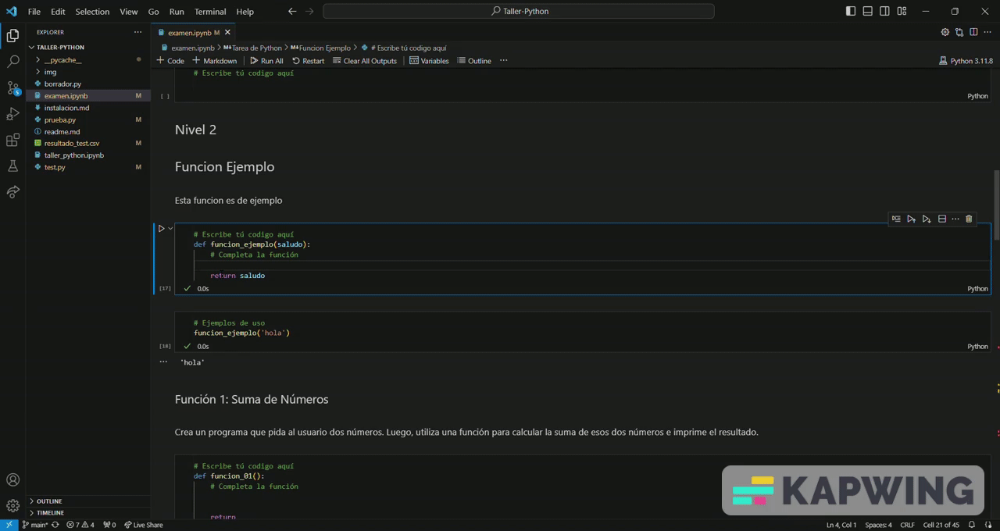

# Bienvenidos al taller de Python

  
  

## Taller de Python: Introducción a la Programación

¡Bienvenido al Taller de Python! Aquí encontrarás los puntos clave que cubrimos durante la sesión para que puedas repasar y consolidar tus conocimientos.

### Contenido:
#### 1. ¿Qué es Python?
Python es un lenguaje de programación de alto nivel, versátil y fácil de aprender. Su sintaxis clara y legible lo convierte en una excelente opción tanto para principiantes como para desarrolladores experimentados.

#### 2. ¿Qué es programar?
Programar es el proceso de escribir instrucciones para que una computadora realice una tarea específica. En este taller, te sumergirás en el mundo de la programación utilizando Python como tu herramienta principal.

#### 3. Características de Python:
Legibilidad: El código Python se destaca por su claridad y simplicidad.
Versatilidad: Puede utilizarse para una amplia variedad de aplicaciones, desde desarrollo web hasta análisis de datos y aprendizaje automático.
Comunidad activa: Python cuenta con una gran comunidad de desarrolladores que comparten recursos y conocimientos.

#### 4. Tipos de variables:
En Python, las variables pueden almacenar diferentes tipos de datos, como enteros, flotantes, cadenas de texto y booleanos. Aprenderás a declarar y manipular estas variables según tus necesidades.

#### 5. Bucles:
For: Itera sobre una secuencia de elementos.
While: Ejecuta un bloque de código mientras se cumple una condición.

#### 6. Condicionales:
Las estructuras condicionales te permiten tomar decisiones en tu código. Aprenderás a utilizar declaraciones "if", "else" y "elif" para controlar el flujo de ejecución.

#### 7. Operaciones entre variables:
Descubre cómo realizar operaciones aritméticas y manipular datos entre variables para realizar cálculos y tareas específicas.

#### 8. Operaciones relacionales y lógicas:
Comprenderás cómo evaluar condiciones mediante operadores relacionales (como "==", "!=", "<", ">") y operadores lógicos (como "and", "or").

## Herramientas Utilizados:
Durante el taller, utilizamos varias herramientas para poner en práctica los conceptos aprendidos. Puedes encontrar las herramientas y como instalarlas aquí:

[Instalación de herramientas](instalacion.md)

## Tarea
Con el objetivo de fortalecer y aplicar los conocimientos adquiridos durante el taller, te proponemos una serie de ejercicios distribuidos en dos niveles. Estas actividades están diseñadas para que puedas poner en práctica lo aprendido durante la sesión, consolidando así tu comprensión de Python.

### Nivel 1: Ejercicios de Reforzamiento
Aquí encontrarás ejercicios más sencillos que te permitirán repasar los conceptos básicos abordados en el taller. Utiliza la información proporcionada durante la sesión como guía para completar estos ejercicios.

### Nivel 2: Desafío
Para aquellos que buscan un reto adicional, el nivel 2 eleva un poco la dificultad. Estos ejercicios son autoevaluativos, lo que implica que puedes verificar tus respuestas ejecutando un test que hemos preparado para ti.

#### Autoevaluación
Para facilitar este proceso, te proporcionamos un tutorial detallado sobre cómo ejecutar el test y verificar tus soluciones. Este tutorial te guiará paso a paso, asegurándote de que estás en el camino correcto.

¡Esperamos que este taller haya sido una experiencia enriquecedora para ti! Continúa practicando y explorando Python para desarrollar tus habilidades de programación.

## Créditos
Desarrollado por:

| Nombre | LinkedIn  |
|--------|-----------|
| Nehuén González   | [LinkedIn](https://www.linkedin.com/in/nehuen-gonzalez/) |
| Ariel Romero  | [LinkedIn](https://www.linkedin.com/in/ariel-w-romero/) |

  
  

